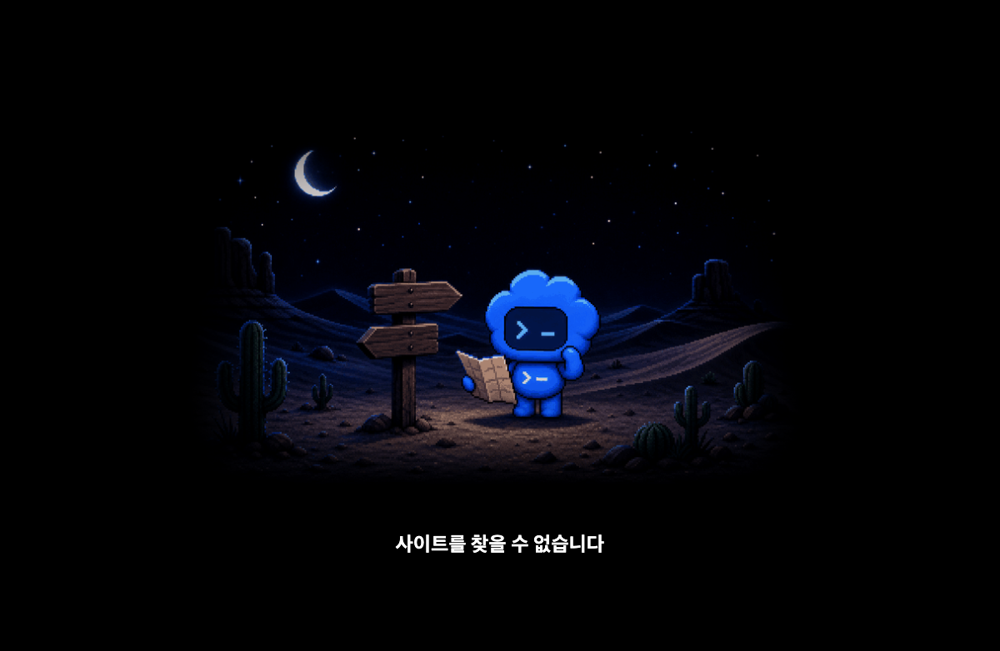
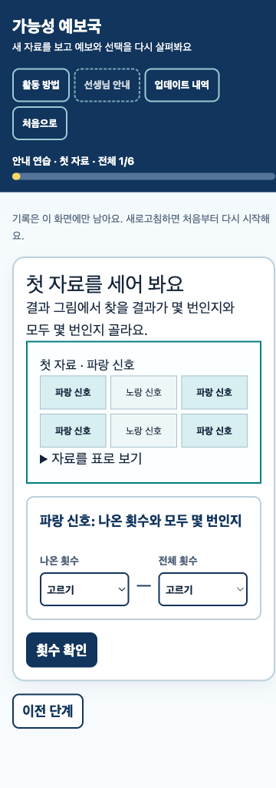
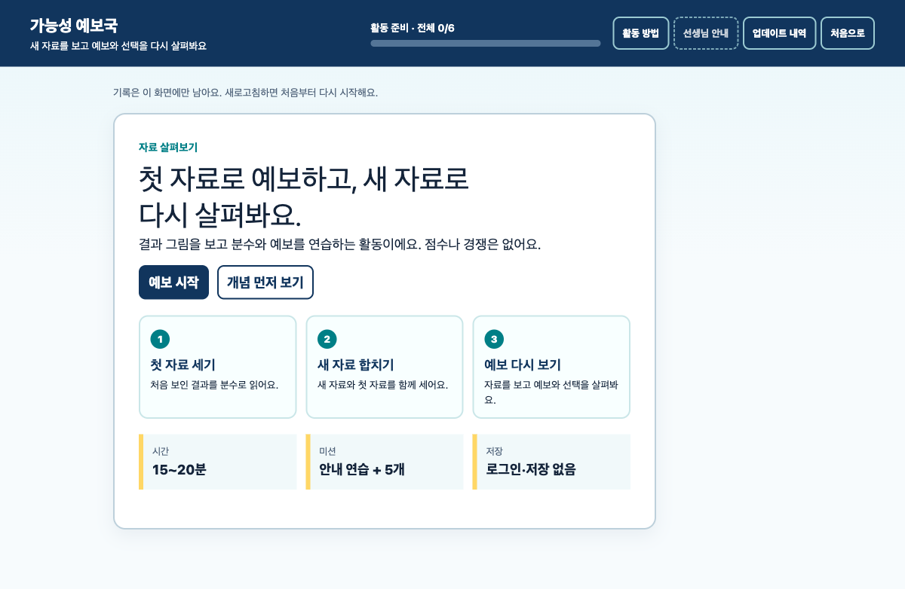
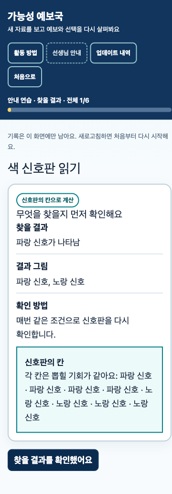

# QA Report: 가능성 예보국

| Field | Value |
|-------|-------|
| **Date** | 2026-08-25 |
| **URL** | `https://possibility-forecast-office.wbmaker.chatgpt.site` (404), `http://localhost:4017` |
| **Branch** | `main` |
| **Commit** | `575cb91` |
| **PR** | — |
| **Tier** | Standard |
| **Scope** | 첫 화면, 개념, 안내 연습, 미션 1~5, 최종 요약, 375×812 모바일 |
| **Duration** | 기준선 약 25분 |
| **Pages visited** | SPA 1개, 주요 상태 49개 |
| **Screenshots** | 기준선 4개 |
| **Framework** | React/Vinext |

## Baseline Health Score: 55/100

| Category | Score |
|----------|-------|
| Console | 85 |
| Links | 20 |
| Visual | 72 |
| Functional | 55 |
| UX | 42 |
| Performance | 90 |
| Accessibility | 88 |

## Top 3 Things to Fix

1. **ISSUE-001: 공개 주소 404** — 학생이 앱에 들어올 수 없다.
2. **ISSUE-002: 내부 영어 값 노출** — 미션 2의 답과 요약에 영어 코드값이 보인다.
3. **ISSUE-003: 풀이 자료가 다음 화면에서 사라짐** — 선택과 누적 계산에 필요한 값을 외워야 한다.

## Summary

| Severity | Count |
|----------|-------|
| Critical | 1 |
| High | 3 |
| Medium | 4 |
| Low | 0 |
| **Total** | **8** |

## Issues

### ISSUE-001: 공개 주소가 404로 열림

| Field | Value |
|-------|-------|
| **Severity** | critical |
| **Category** | functional |
| **URL** | 공개 URL |

**Description:** 2026-08-25 기준 공개 주소의 제목은 `찾을 수 없음`, HTTP 상태는 404였다. 로컬 복구본은 정상 실행된다.

**Evidence:** 

### ISSUE-002: 학생 선택지와 요약에 내부 영어 값 노출

| Field | Value |
|-------|-------|
| **Severity** | high |
| **Category** | content / functional |
| **URL** | 미션 2 첫 선택, 최종 선택, 비교, 최종 요약 |

**Description:** `more-likely`, `less-likely`가 라디오 이름과 선택 기록에 그대로 보인다. 학생은 뜻을 알 수 없고 화면 언어도 일관되지 않는다.

### ISSUE-003: 선택·누적 계산 화면에 필요한 자료가 없음

| Field | Value |
|-------|-------|
| **Severity** | high |
| **Category** | ux / functional |
| **URL** | 모든 미션의 첫 선택, 모두 합친 자료, 최종 선택 |

**Description:** 첫 선택에서는 이전 화면의 칸 수나 비율을, 누적 계산에서는 첫 자료와 새 자료 횟수를 기억해야 한다. 미션 1의 예: 파랑 `5+3`, 초록 `5+7`, 회색 `2+2`라는 중간값 없이 0~24에서 답을 고르게 한다.

### ISSUE-004: 실제 결과와 신호판 칸의 쓰임이 연결되지 않음

| Field | Value |
|-------|-------|
| **Severity** | high |
| **Category** | educational UX |
| **URL** | 알려진 구조를 쓰는 안내 연습, 미션 1, 미션 5 |

**Description:** 미션 5에서 학생은 빨강 `5/5`를 센 직후 설명 없이 신호판 `1/2`로 예보해야 한다. 두 수가 왜 다른지와 어느 수를 고를지 같은 화면에서 설명해야 한다.

### ISSUE-005: 같은 결과 그림의 반복과 긴 모바일 스크롤

| Field | Value |
|-------|-------|
| **Severity** | medium |
| **Category** | visual / ux |
| **URL** | 여러 찾을 결과가 같은 실행 자료를 공유하는 미션 |

**Description:** 미션 1과 5에서 같은 실행 결과가 찾을 항목별로 반복된다. 데스크톱에서도 길고 모바일에서는 선택 상자까지 도달하기 전에 맥락을 잃기 쉽다.

### ISSUE-006: 미선택과 오답의 안내가 같고 구체성이 부족함

| Field | Value |
|-------|-------|
| **Severity** | medium |
| **Category** | ux / content |
| **URL** | 횟수, 예보, 선택 검증 단계 |

**Description:** 아무것도 고르지 않은 경우에도 `다시 비교해 골라 주세요`가 나와, 먼저 어떤 칸을 눌러야 하는지 알려 주지 않는다. 오답도 어느 자료를 다시 볼지 충분히 좁혀 주지 않는다.

### ISSUE-007: 조사와 문장부호 오류

| Field | Value |
|-------|-------|
| **Severity** | medium |
| **Category** | content |
| **URL** | 미션 4·5 찾을 결과, 일부 최종 예보 |

**Description:** `파란 표식가 나타남`, `빨강가 나타남`, `신호판의 칸은 그대로예요.:`가 노출된다.

### ISSUE-008: 다음 행동의 시각적·문장 안내 부족

| Field | Value |
|-------|-------|
| **Severity** | medium |
| **Category** | ux / accessibility |
| **URL** | 전체 학습 단계 |

**Description:** 주요 버튼은 동작하지만 다른 컨트롤과 비슷하고, 화면마다 `지금 할 일`이 없다. 375×812에서 가로 넘침은 없었으나 핵심 버튼 너비가 93px인 화면이 있어 발견 가능성을 높일 필요가 있다.

**Evidence:** 

## Baseline Browser Evidence

- 데스크톱 첫 화면: 
- 모바일 첫 화면: 
- 375×812 가로 넘침: 없음 (`scrollWidth 360 <= innerWidth 375`)
- 로컬 콘솔 오류: 없음
- 실제 아동 참가자 조사: 미실시. 초등학생 첫 사용 상황을 가정한 직접 조작 휴리스틱 테스트임.

## Fixes Applied

구현과 회귀 테스트 뒤 이 표를 갱신한다.

| Issue | Fix Status | Commit | Files Changed |
|-------|-----------|--------|---------------|
| ISSUE-001~008 | planned | — | — |

## Ship Readiness

| Metric | Value |
|--------|-------|
| Health score | 55 → 측정 예정 |
| Issues found | 8 |
| Fixes applied | 0 |
| Deferred | 0 |
